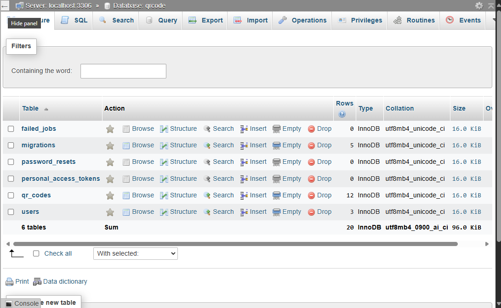
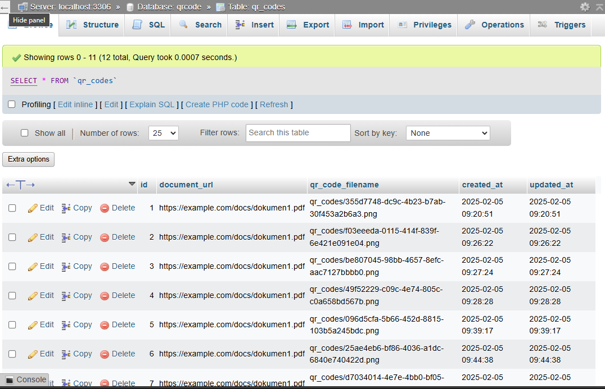
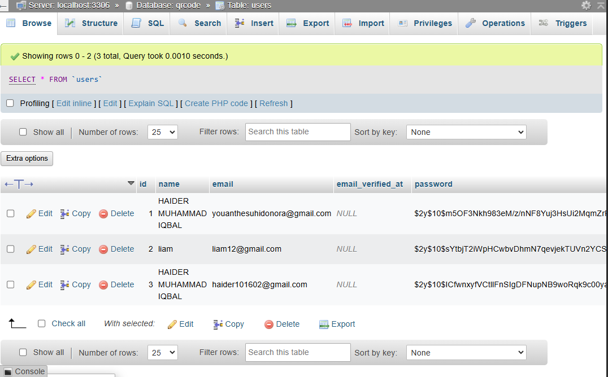
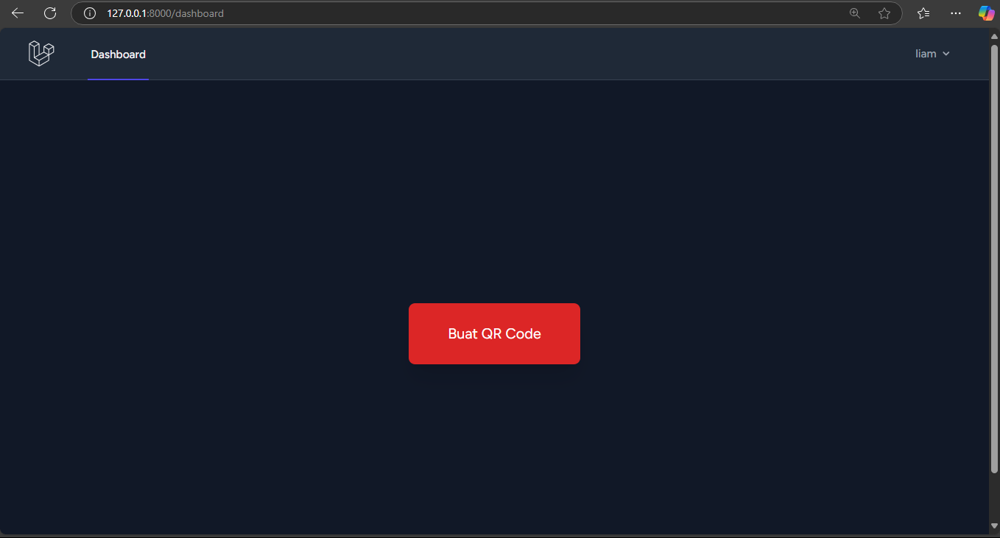
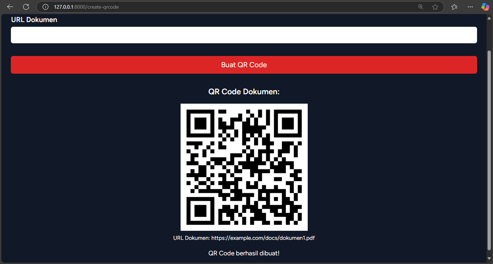
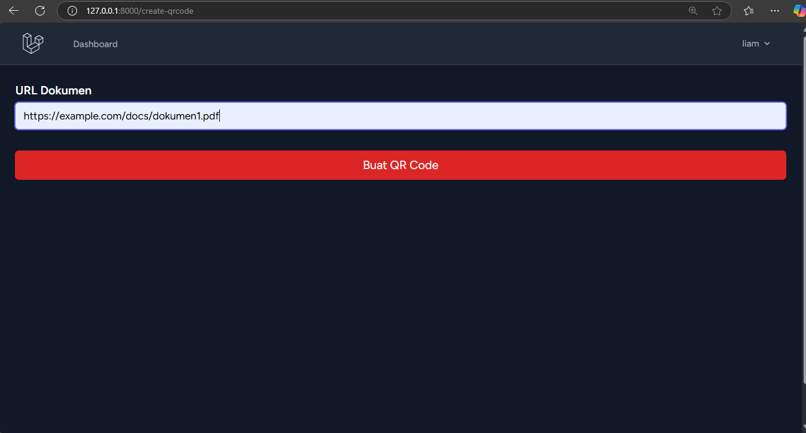
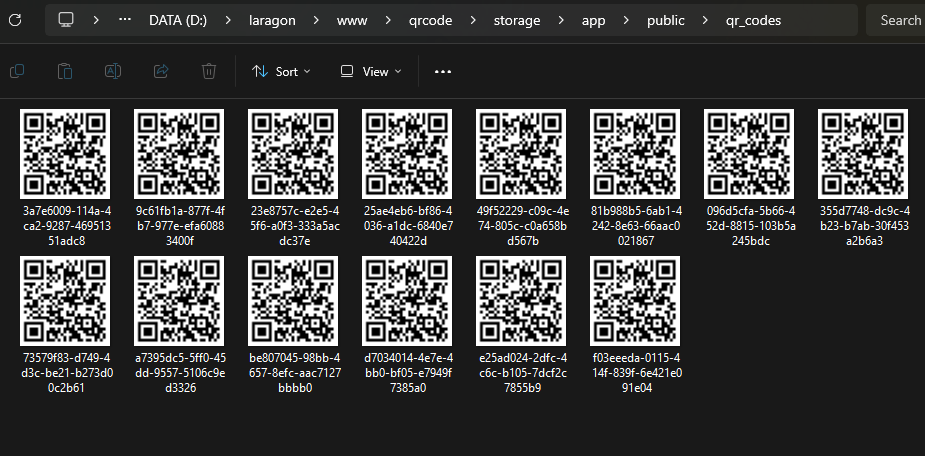

<p align="center"><a href="https://laravel.com" target="_blank"></a></p>

<p align="center">
<a href="https://github.com/laravel/framework/actions"></a>
<a href="https://packagist.org/packages/laravel/framework"></a>
<a href="https://packagist.org/packages/laravel/framework"></a>
<a href="https://packagist.org/packages/laravel/framework"></a>
</p>

# Project qrcode
## Instalasi
1. Membuat Project Baru:  
   ```
   create-project laravel/laravel qrcode
   ```
2. Masuk ke folder project:  
   ```
   cd qrcode
   ```
3. Membuat Database Baru dengan nama database "qrcode"  
   
4. Mengubah Nama Database Pada File `.env` dan sesuai dengan nama Database yang      telah dibuat.  
5. Jalankan Migrasi Database:   
   ```
   php artisan migrate
   ```
   
   
6. Membuat model Laravel bernama QrCode beserta file migrasi database-nya:  
   ```
   php artisan make:model QrCode -m
   ```
7. Menginstall Library QR Code untuk Laravel:
   ```
   composer require simplesoftwareio/simple-qrcode
   ```
8. Jalankan Migrasi Database-nya lagi:  
   ```
   php artisan migrate
   ```
9. Menginstal Laravel Breeze sebagai paket autentikasi di Laravel:
   ```
   composer require laravel/breeze --dev
   ```
10. Jalankan Aplikasi:
    ```
    php artisan serve
    ```
11. Membuat file QrCodeController didalam folder app/Http/Controller.
12. Menambahkan `Route` pada file routes/web.php.
13. Tampilan Hasil :
    - Setelah Berhasil Login/Register, User akan diarahkan ke halaman Dashboard: 
    
    - Tampilan Halaman Create QR Code :
    
    - Tampilan Hasil Create QR Code setelah User memasukkan URL dokumen yang kemudian akan di implementasikan menjadi sebuah QR Code: 
    
    - QR Code akan tersimpan di folder storage/app/public/qr_codes : 
    
